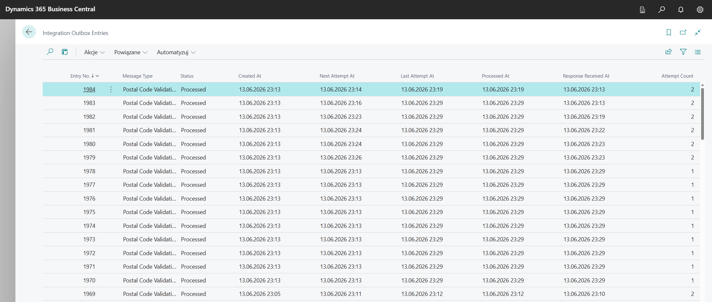
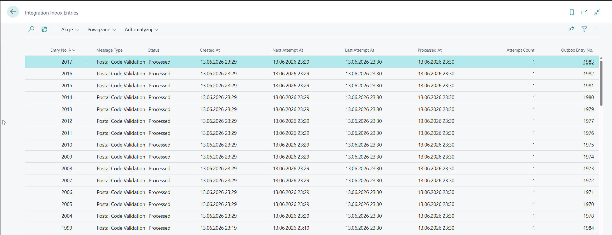
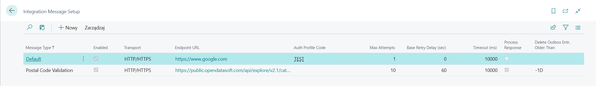
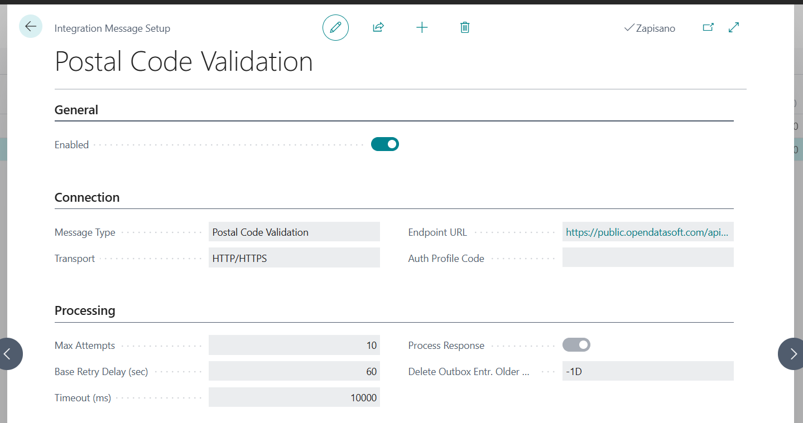
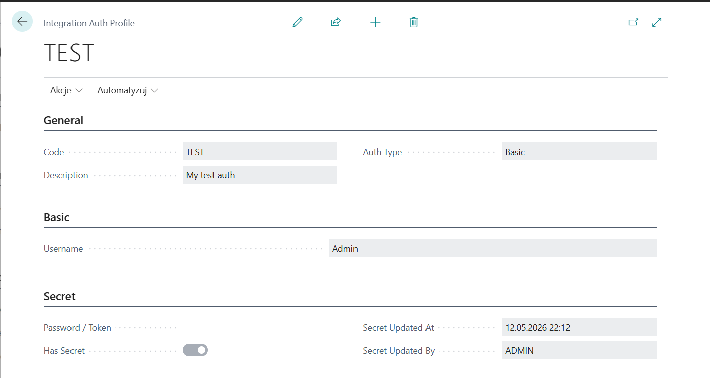
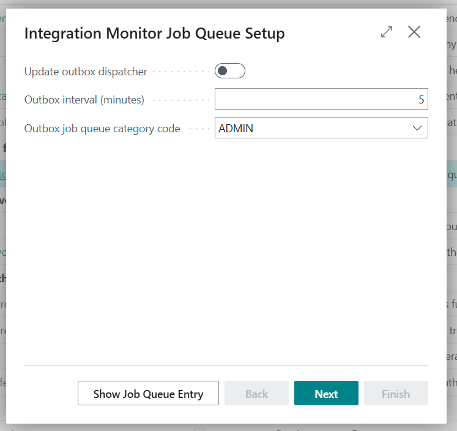
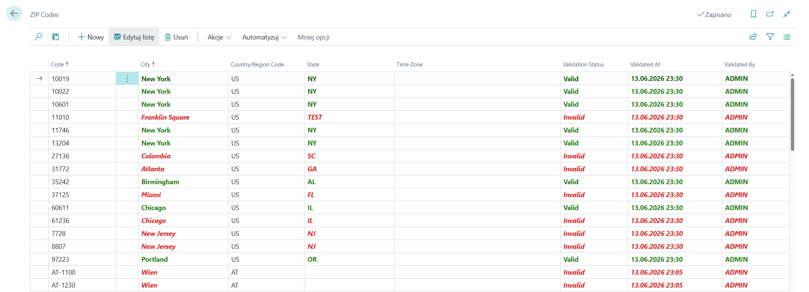

# Integration Monitor

> A Business Central AL integration framework — persistent outbox/inbox queues, retry logic, auth profiles, and monitoring pages. Install it, implement two interface methods in your own extension, and your integration is ready.


---


## The Problem

Standard BC integrations call external APIs inline — from a page action or a posting routine. When the call fails, the data is gone. There is no queue entry to inspect, no payload to debug, no automatic retry, and no audit trail.

Integration Monitor solves this by introducing a persistent outbox that sits between your business logic and the network. Every message is written to a table first. A job queue then picks it up, sends it, and handles the failure — not your code.

---

## This Is a Framework

Integration Monitor does not do anything out of the box. It provides the **infrastructure** for reliable BC integrations. You build a separate AL extension that plugs into it.

**What your extension implements:**

| Your responsibility | AL construct |
|---|---|
| Build the HTTP request for your API | `IMessageHandler.BuildRequest` |
| Parse the response and update BC records | `IMessageHandler.ProcessResponse` |
| Trigger enqueue from business logic | One `Enqueue` call |

**What the framework handles for you — automatically:**

- Persisting every outbox entry before any network call is made
- Running dispatcher jobs on a configurable schedule
- Applying Basic or Bearer authentication from isolated storage
- Sending HTTP requests with per-message timeout
- Detecting failures and scheduling retries with configurable backoff
- Capping retries and marking entries as cancelled after max attempts
- Storing HTTP responses as BLOBs on the outbox entry
- Creating inbox entries for async response processing
- Running inbox dispatcher jobs and calling your response handler
- Recording full error text and payloads for every failed attempt
- Monitoring pages to inspect, manually retry, or cancel entries
- Retention cleanup via a configurable `DateFormula` per message type

---

## How It Works

```
 ┌─ Your extension ──────────────────────────────────────────────────┐
 │                                                                   │
 │   OutboxEntryMgt.Enqueue(MessageType, RecordId, Payload)          │
 │                                                                   │
 └──────────────────────────────┬────────────────────────────────────┘
                                │
                                ▼
 ┌─ Framework · Outbox Dispatcher Job ───────────────────────────────┐
 │                                                                   │
 │   1. YOUR IMessageHandler.BuildRequest()                          │
 │   2. IHttpTransportHandler.Send()                                 │
 │      ├─ success → store response payload, mark Processed          │
 │      └─ failure → record error, schedule retry (or cancel)        │
 │   3. When Process Response = true → create Inbox entry            │
 │                                                                   │
 └──────────────────────────────┬────────────────────────────────────┘
                                │  (only when Process Response = true)
                                ▼
 ┌─ Framework · Inbox Dispatcher Job ────────────────────────────────┐
 │                                                                   │
 │   YOUR IMessageHandler.ProcessResponse()                          │
 │                                                                   │
 └──────────────────────────────┬────────────────────────────────────┘
                                │
                                ▼
 ┌─ Framework · Cleanup Job ─────────────────────────────────────────┐
 │                                                                   │
 │   Delete processed/cancelled entries per retention DateFormula    │
 │                                                                   │
 └───────────────────────────────────────────────────────────────────┘
```

---

## Monitoring Pages

Everything that moves through the framework is visible and actionable.

### Outbox Entries

Every outbound message — its status, attempt count, timestamps, request payload, and last error — is visible in one list. You can inspect the payload, view the error, manually trigger processing, reset a failed entry, or cancel it.


### Inbox Entries

When a message setup has **Process Response** enabled, the HTTP response is materialized as an inbox entry. The same actions are available: view payload, view error, process manually, reset, cancel.



### Message Setup

One configuration record per message type — endpoint URL, transport, auth profile, retry settings, timeout, and retention formula. Enabling a setup validates that transport and auth are properly configured.





### Auth Profiles

Authentication credentials are stored in BC isolated storage — not in plain table fields. A profile stores the type (Basic or Bearer) and a flag indicating whether a secret has been set.



### Assisted Setup

A guided wizard available from BC Assisted Setup creates the three dispatcher job queue entries. It detects existing entries, loads their current settings, and lets you update interval and category code without touching the job queue directly.



---

## Building an Extension on Top of This Framework

### 1. Add your message type

```al
enumextension 50200 "My Message Types" extends "AMC Int. Message Type"
{
    value(50200; "Invoice Sync")
    {
        Implementation = "AMC IMessageHandler" = "My Invoice Sync Handler";
    }
}
```

### 2. Implement the message handler

```al
codeunit 50200 "My Invoice Sync Handler" implements "AMC IMessageHandler"
{
    procedure BuildRequest(OutboxEntry: Record "AMC Int. Outbox Entry"; var Request: HttpRequestMessage)
    begin
        // Read OutboxEntry payload, build your API request
        Request.Method := 'POST';
        Request.SetRequestUri(/* your endpoint */);
        // set headers, content, etc.
    end;

    procedure ProcessResponse(InboxEntry: Record "AMC Int. Inbox Entry")
    begin
        // Read InboxEntry payload, update your BC records
    end;
}
```

### 3. Enqueue from your business logic

```al
// One line — the framework takes it from here
OutboxEntryMgt.Enqueue("AMC Int. Message Type"::"Invoice Sync", Rec.RecordId, PayloadText);
```

That's the entire contract. The framework handles persistence, dispatch, auth, retries, response storage, inbox processing, monitoring, and cleanup.

---

## Getting Started

### 1. Install the extension

Publish the app to your BC environment. BC 27.0 (2025 Wave 1) or later is required.

### 2. Run Assisted Setup

Search for **Set up Integration Monitor job queues** in Assisted Setup. The wizard creates three job queue entries:

| Job | Purpose |
|-----|---------|
| Outbox Dispatcher | Picks ready/failed outbox entries and sends them |
| Inbox Dispatcher | Picks ready/failed inbox entries and processes responses |
| Outbox Cleanup | Deletes old processed/cancelled entries |

### 3. Create a Message Setup record

Open **Integration Message Setup** and create a record for your message type.

| Field | Description |
|-------|-------------|
| Message Type | Identifies which integration this config applies to |
| Endpoint URL | The target API URL |
| Transport | HTTP/HTTPS (default) |
| Auth Profile | Optional Basic or Bearer token profile |
| Max Attempts | How many times to retry before cancelling |
| Process Response | Enable if the HTTP response needs inbox processing |
| Delete Outbox Entries Older Than | DateFormula for retention cleanup, e.g. `<-30D>` |

---

## Included Demo: Postal Code Validation

The extension ships with a complete end-to-end demo that validates BC Post Codes against the free OpenDataSoft API. It shows exactly what a real consumer extension looks like and lets you see the outbox/inbox flow working without writing any code.

**Demo setup** — create a Message Setup record for **Postal Code Validation**:

| Field | Value |
|-------|-------|
| Endpoint URL | `https://public.opendatasoft.com/api/explore/v2.1/catalog/datasets/geonames-postal-code/records` |
| Transport | HTTP/HTTPS |
| Enabled | Yes |
| Process Response | Yes |
| Max Attempts | 1 |
| Timeout (ms) | 10000 |

**Demo usage:**

1. Open **Zip Codes**
2. Select one or more rows
3. Run the **Validate** action
4. Watch the entries appear in **Integration Outbox Entries**
5. Run or schedule **AMC Outbox Dispatcher Job**
6. Each post code is marked **Valid** or **Invalid** once the inbox entry is processed

The demo source in `src/demo/` is a reference implementation showing how a real extension registers a message type, builds the request, and writes results back to BC records.



## Project Structure

```
src/
  AssistedSetup/   Guided setup wizard and job queue management
  Auth/            Auth profiles, Basic/Bearer, isolated storage
  Helpers/         BLOB helper and generic payload viewer page
  Inbox/           Inbox table, dispatcher, processor, failure handler, monitor page
  Message/         IMessageHandler interface, message type enum, default handler
  Outbox/          Outbox table, dispatcher, processor, failure handler, cleanup, monitor page
  Setup/           Message setup table, validation, admin pages
  Transport/       IHttpTransportHandler interface, HTTP/HTTPS default transport
  demo/            Postal code validation — complete example consumer extension
```

---

## Status

Early-stage, under active development. Core flows (outbox, inbox, auth, cleanup, assisted setup) are functional. Automated tests are not yet included.

Contributions, issues, and feedback are welcome.
